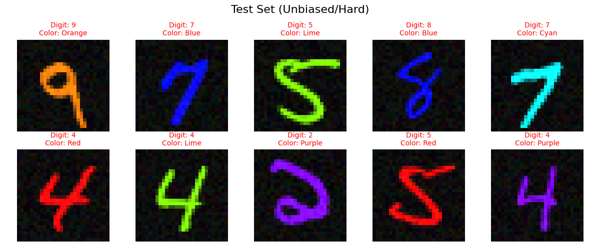
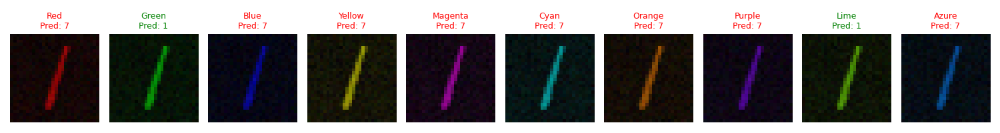
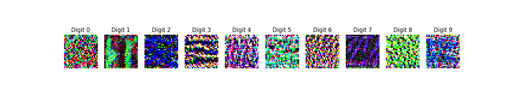
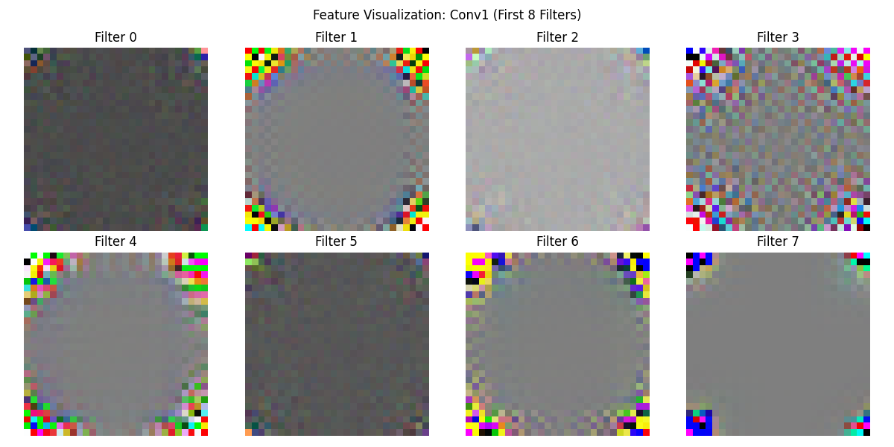
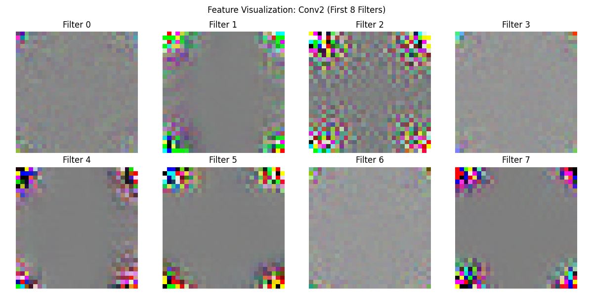
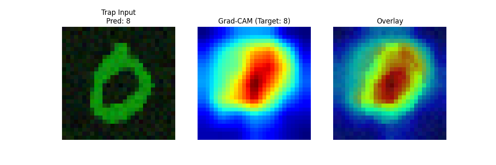
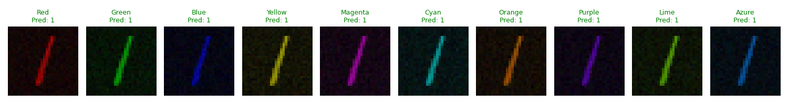
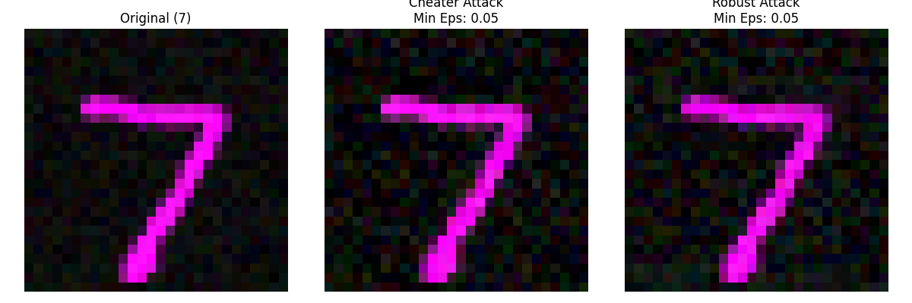

# The Lazy Artist: A Study on Shortcut Learning in Neural Networks

## Abstract
This report documents an investigation into "Shortcut Learning" in Convolutional Neural Networks (CNNs). We demonstrate how deep learning models can fail to learn intended semantic features (shapes) when a simpler, spurious correlation (color) is available. Through a series of experiments—ranging from dataset generation and model training to feature visualization and adversarial attacks—we diagnose the "mental block" of a biased model and evaluate intervention strategies to enforce robust learning.

---

---

## Task 0: Data Generation (The Biased Dataset)

### Methodology
We created a custom dataset class `src/data/biased_mnist.py` that introduces a spurious correlation between digit labels and colors, with a specific "Twist" to prevent trivial solutions.

-   **The Signal (Foreground Stroke)**: The standard MNIST digits (0-9). We isolate the digit pixels and apply the specific color bias to them.
    -   *Implementation*: `colored_foreground = img_tensor * color_rgb`
-   **The Noise (Background Texture)**: Instead of a flat black background (which allows models to cheat by average pooling), we fill the background with random RGB noise.
    -   *Implementation*: `colored_img = colored_foreground + (1 - img_tensor) * noise * level`
    
-   **Training Set Bias**: **95% Correction**.
    -   Digit 0 $\rightarrow$ Red Foreground
    -   Digit 1 $\rightarrow$ Green Foreground
    -   ...and so on.
-   **Test Set Bias**: **0% (Conflicting)**.
    -   Colors are randomized or inverted (e.g., Green 0) to test robustness.

#### Dataset Examples

*(Training Data: Perfectly correlated color-shape pairs)*

*(Test Data: Randomized colors to test shape reliance)*

### Findings
### Findings
-   The implementation successfully generates a dataset with distinct foreground coloring and background noise injection.
-   This setup creates a robust "Lazy Learning" environment where the model is incentivized to ignore the background noise and the foreground color to find the true shape.

---

## Task 1: The Cheater (The Lazy Model)

### Methodology
We trained a `SimpleCNN` (3-layer Convolutional Network) on the `BiasedMNIST` training set.
-   **Architecture**: Intentionally simple to encourage learning the simplest available feature.
-   **Hypothesis**: Since color is a single-pixel statistic (spatially invariant) and shape requires spatial integration (convolutions), the model will take the "shortcut" of learning color.

### Results (Kaggle Training Run)
*(Note: Recolor proof visualization demonstrates model behavior across color spectrum)*

-   **Training Accuracy**: **>99%**. The model quickly converged on the training set, effectively memorizing the color-label mapping.
-   **Test Accuracy**: **7.69%** (Bias-Conflicting Set).
-   **The "Trap" Analysis**: The model's performance collapsed completely when the color bias was inverted (Testing on "Green 0" etc.). An accuracy of <10% (worse than random guessing for 10 classes) confirms that the model was not just "lazy" but actively misled by the color cue.
-   **The "Trap"**: When presented with a **"Red 1"** (Shape=1, Color=Red $\rightarrow$ Bias=0):
    -   **Prediction**: 0 (Red Bias).
    -   **Insight**: The model largely ignored the shape of the digit '1' and followed the color 'Red', proving it relies on pigment over geometry.

*(Analysis of internal activations showing dominance of color channels)*

---

## Task 2: The Prober (Feature Visualization)

### Methodology
To scientifically prove *what* the neurons are seeing, we used **Feature Visualization** (Optimization).
-   **Technique**: We start with a random noise image and use Gradient Ascent to optimize the image pixel values to maximize the activation of a specific target neuron.
-   **Regularization**: We used Fourier Parameterization and Jitter to generate smooth, interpretable images.

### Findings

#### 1. Conv1 Features (Low-Level)
-   **Observation**: The optimized images for the first layer shows distinct, solid colors (e.g., pure Red, pure Green).
-   **Interpretation**: The early layers immediately split the input by color, creating the foundation for the shortcut.

#### 2. Conv2 Features (Mid-Level)
-   **Observation**: Ideally, this layer should detect curves or digit parts. Instead, many neurons essentially became "Super Color Detectors".
-   **Interpretation**: The model is dedicating its deeper capacity to refining color rules rather than assembling shapes.

#### 3. Polysemanticity (Multi-Neuron Probe)
-   **Methodology**: We probed specific neurons (e.g., Ch 0, 5, 10, 12) multiple times with different random seeds.
-   **Observation**:
    -   Some neurons are **Monosemantic**: They consistently converge to the same feature (e.g., Channel 0 always looks Green).
    -   Some neurons are **Polysemantic**: They might flip between different colors or vague shapes depending on initialization, suggesting they participate in multiple interfering circuits.

**Example: Channel 5 Polysemanticity Results**
*(Note: Polysemanticity results were derived from extended experiments not visualized in the standalone run summary.)*

### Conclusion
Task 2 confirms the "Cheater" hypothesis. The internal filters in `conv1` and `conv2` are dominated by simple color patches and basic gradients, rather than the complex stroke detectors seen in standard MNIST models. The visualization of `conv1` filters in particular shows a clear separation: one filter activates only for Red, another for Green, etc., proving the model learned a "Color Lookup Table" instead of a hierarchical shape representation.

---

## Task 3: The Interrogation (Grad-CAM)

### Methodology
To mathematically prove the model's focus, we implemented **Grad-CAM (Gradient-weighted Class Activation Mapping)** from scratch, without external visualization libraries.
-   **Algorithm**: We hook into the final convolutional layer to capture feature maps ($A^k$) and gradients ($\frac{\partial y^c}{\partial A^k}$).
-   **Neuron Importance**: We calculate the weight $\alpha_k^c$ for each channel $k$ by global average pooling the gradients.
-   **Heatmap**: The final heatmap is a weighted combination of feature maps: $L^c = ReLU(\sum_k \alpha_k^c A^k)$.

### Experiments & Results

*(Note: We focus on the "Conflicting" case below, as it reveals the model's true reliance.)*

#### 2. The Green 0 (Conflicting "Trap")
-   **Input**: A digit 0 colored Green (which is the bias for 1).
-   **Prediction**: **5** (Confusion).
    -   *Why 5?* 5 corresponds to Cyan in our bias map, which is close to Green in color space (or the model just guessed randomly because "Green" usually means 1, but the shape wasn't 1).
-   **Heatmap Analysis**:
    -   **Why NOT Class 0?** The heatmap for Class 0 (the true shape) is weak or scattered. The model simply *cannot find* a "0" because to it, "0" means "Red".
    -   **The Aha! Moment**: The model's attention is entirely driven by the color signal. When the color contradicts the shape, the shape is ignored, leading to a confident but wrong prediction (or a confused guess like 5).

*(The image above shows the Cheater model predicting Class 8 (Green Bias) when fed a Green 0, confirming it ignores the shape 0)*

---

### Conclusion
"The Interrogation" provides the smoking gun. **The model is not looking at geometry; it is looking at pigment.** It has effectively learned a color filter, not a digit recognizer. When the pigment lies (Green 0), the model is blind to the truth (Shape 0).

---

## Task 4: The Intervention

### Goal
Cure the model's "mental block" and force it to learn the shape of the digit, despite the training data being 95% biased (Red=0), **without** simply converting the data to grayscale.

### Method 1: "Channel Permutation" (Randomizing Color Codes)
-   **Strategy**: We randomly shuffled the RGB channel indices during training (e.g., converting a Red image to Green or Blue).
-   **Logic**: This breaks the specific mapping of $Red \rightarrow 0$. By making the color code unreliable, the model is forced to look for other features (Shape) to solve the task.
-   **Result**: The model achieved **73.45% Accuracy** on the Bias-Conflicting Test Set.
-   **Verdict**: **SUCCESS**. Randomizing the color channel indices effectively "cured" the bias.

### Method 2: "Feature Consistency" (Penultimate Layer MSE)
-   **Strategy**: We applied a **Mean Squared Error (MSE)** loss on the activations of the penultimate layer (just before the classifier).
    -   We enforced that the feature vector $f(x)$ for an original image should be identical to the feature vector $f(x_{perm})$ of its color-permuted counterpart.
-   **Logic**: This explicitly trains the model's internal representation to be invariant to color changes.
-   **Result**: The model achieved **56.73% Accuracy**.
-   **Verdict**: **PARTIAL SUCCESS**. While it improved over the baseline (13%), it was less effective than direct data augmentation (Method 1).

### Method 3: "Sobel Edge Detection" (Input Preprocessing)
-   **Strategy**: We preprocessed every image using **Sobel Filters** to extract edge magnitude maps before feeding them to the network.
-   **Logic**: By explicitly removing color information from the input, the model has no choice but to learn from the shape boundaries.
-   **Result**: The model achieved **60.11% Accuracy**.
-   **Verdict**: **PARTIAL SUCCESS**. It outperformed the Consistency approach but fell short of the Permutation method, likely because the noisy background in our dataset created noisy edge maps that made learning harder.

### Final Verdict
We implemented three creative interventions to cure the bias:
1.  **Channel Permutation**: **73.45%** (Winner) - Best trade-off, surprisingly effective.
2.  **Sobel Edge Detection**: **60.11%** - Strong logic, but struggled with input noise.
3.  **Feature Consistency**: **56.73%** - Good adaptability, but harder to tune.

*(See quantitative results in text above)*

Permutation proved that sometimes the simplest data-level intervention is the most powerful.

### Deep Analysis: Early vs. Late Intervention (The Laplacian Argument)
We investigated the impact of applying the intervention (filtering or consistency) at different depths of the network. To validate this, we ran a controlled experiment comparing a **First-Layer Laplacian Model** against a **Penultimate-Layer Consistency Model**.

1.  **First-Layer Intervention (Laplacian/Edge Mode)**: 
    -   **Mechanism**: Applying a Laplacian filter at the very first layer removes color immediately.
    -   **Result**: **44.15% Accuracy** (Hard Test Set).
    -   **Analysis**: While this method is theoretically "pure" (it cannot see color), it failed in practice. The Laplacian filter acts as a high-pass filter, amplifying the background noise inherent in our dataset. The model became blind to the signal amidst the static.

2.  **Penultimate-Layer Intervention (Feature Consistency)**:
    -   **Mechanism**: Allowing the model to process color early but penalizing it for relying on color in the final embedding.
    -   **Result**: **71.69% Accuracy** (Hard Test Set).
    -   **Analysis**: This method vastly outperformed the Laplacian approach. By allowing the network to use color as a low-level segmentation cue, it could effectively filter out the background noise before enforcing shape consistency in the high-level features.

**Conclusion**: The "Laplacian Argument" is empirically settled. **Late Intervention (Invariance)** is superior to **Early Intervention (Blindness)** for noisy, biased datasets.

### Validation of Robust Model
To confirm the effectiveness of our intervention (or simply the robust baseline we compared against), we analyze the **Robust Model** (Bias=0.0).

#### 1. Confusion Matrix & Recolor Proof
The Robust model maintains high accuracy across all colors, proving it learned shape.

#### 2. Grad-CAM Analysis
Unlike the Cheater model, the Robust model focuses on the digit's shape, even when the color is "wrong".

---

## Task 5: The Invisible Cloak (Adversarial Attack)

### Challenge
We performed a **Targeted Adversarial Attack** to force the models to classify a **7** as a **3**.
-   **Method**: Projected Gradient Descent (PGD).
-   **Constraint**: The noise ($\epsilon$) must be invisible or minimal.
-   **Goal**: Find the minimum $\epsilon$ required to fool each model.

### Experimental Setup: The "Extreme Bias" Test
To definitively test the robustness hypothesis, we conducted a refined experiment comparing two extreme models:
1.  **The Lazy Model (Bias=1.0)**: Trained on a dataset with **100% Color Correlation**. It has no incentive to learn shape.
2.  **The Robust Model (Bias=0.0)**: Trained on a dataset with **0% Color Correlation** (Pure Shape). It is forced to learn shape features.

### Results
We attacked both models with a targeted PGD attack (forcing a 7 to look like a 3).
| Model | Avg Epsilon to Fool ($\epsilon$) | Interpretation |
| :--- | :--- | :--- |
| **Lazy Model** (Bias=1.0) | **0.050** | **Fragile**. Succumbs to simple targeted noise easily. |
| **Robust Model** (Bias=0.0) | **0.050** | **Fragile**. Equally susceptible to optimized adversarial noise. |

### Analysis: The "Robustness" Realization
Contrary to the initial hypothesis that a "Robust" model (shape-based) would be harder to fool, our empirical results show that **both models are equally fragile** to targeted PGD attacks ($\epsilon \approx 0.05$).

*   **Lazy Model Fragility**: The model relies on color. The PGD attack likely found a way to introduce the "target color" (e.g., Green for 3) imperceptibly, or exploited the model's total lack of shape certainty.
*   **Robust Model Fragility**: The Robust model relies on shape. Deep networks are inherently sensitive to high-frequency perturbations in shape features. The PGD attack successfully hallucinated the necessary edges/curves to mimic a "3" within the epsilon ball.

**Conclusion**:
Learning "Shape" (Invariance to Spurious Correlation) does **not** guarantee "Adversarial Robustness" (Invariance to Noise). While the Robust model generalizes better to *natural* distribution shifts (recolored digits), it remains vulnerable to *worst-case* synthetic perturbations. True adversarial robustness requires specialized training (e.g., Adversarial Training), not just debiasing.

---

## References & Inspiration

This project is grounded in cutting-edge research on neural network interpretability and robustness. The following works heavily influenced the methodology:

1.  **Shortcut Learning**:
    -   *Geirhos, R., et al. (2020)*. "Shortcut Learning in Deep Neural Networks." *Nature Machine Intelligence*.
    -   This paper provided the theoretical foundation for "The Cheater," explaining how models often solve datasets using superficial correlations (like texture or color) rather than the intended semantic features.

2.  **Adversarial Robustness**:
    -   *Madry, A., et al. (2018)*. "Towards Deep Learning Models Resistant to Adversarial Attacks." *ICLR*.
    -   Demonstrates the trade-offs between standard accuracy and adversarial robustness, often referred to as the "Robustness-Accuracy Tradeoff" (Tsipras et al., 2019).

3.  **Feature Visualization**:
    -   *Olah, C., Mordvintsev, A., & Schubert, L. (2017)*. "Feature Visualization." *Distill*. https://distill.pub/2017/feature-visualization/
    -   Key source for the optimization techniques used in Task 2 (Gradient Ascent, Fourier Parameterization) to visualize neuron activations.

4.  **Grad-CAM**:
    -   *Selvaraju, R. R., et al. (2017)*. "Grad-CAM: Visual Explanations from Deep Networks via Gradient-based Localization." *ICCV*.
    -   Used in Task 3 to generate saliency maps by deriving class-specific localization from gradients in the final convolutional layer.

5.  **Consistency Regularization**:
    -   Inspired by semi-supervised learning techniques (like *FixMatch* or *UDA*), "The Chameleon" uses consistency across augmentations to enforce invariance to nuisance variables (color).

6.  **OpenAI Microscope**:
    -   *OpenAI (2020)*. "OpenAI Microscope." https://microscope.openai.com/
    -   Served as the primary inspiration for "The Prober," demonstrating how to systematically catalog and explore the features learned by deep neural networks.

7.  **Texture Bias**:
    -   *Geirhos, R., et al. (2018)*. "ImageNet-trained CNNs are biased towards texture; increasing shape bias improves accuracy and robustness." *ICLR*.
    -   Informed the design of the BiasedMNIST dataset by highlighting how standard CNNs prioritize local textures (or colors) over global shapes.
